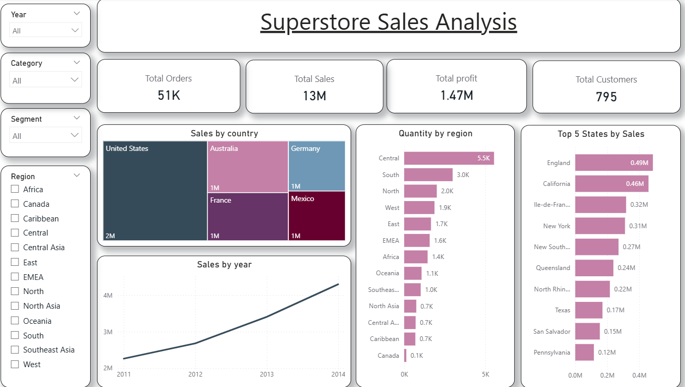
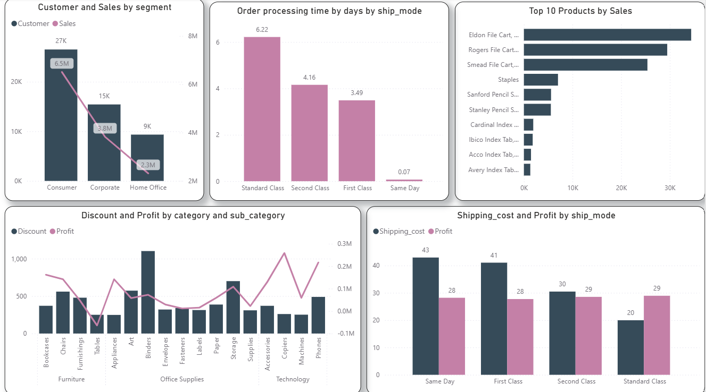
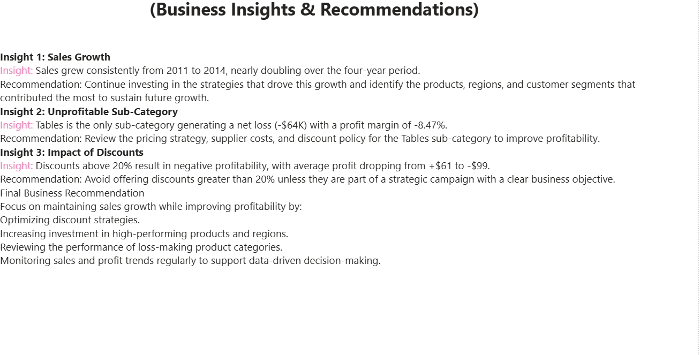

# 📊 Superstore Sales Analysis — SQL + Power BI

An end-to-end sales analytics project analyzing 51,290 orders from a global superstore, built with SQL Server for data cleaning/analysis and Power BI for interactive visualization and business insights.

## 📌 Project Overview

| Detail | Info |
|---|---|
| Tools | SQL Server (T-SQL), Power BI |
| Dataset | Superstore Orders Dataset (Kaggle), 51,290 orders |
| Total Orders | 51K |
| Total Sales | $13M |
| Total Profit | $1.47M |
| Total Customers | 795 |
| Countries Covered | 147 |
| Years Covered | 2011 – 2014 |

## 🧹 Data Cleaning (SQL)

- Verified row counts and confirmed no missing (NULL) values across all 21 columns
- Found `sales` column stored as text (`VARCHAR`) because ~2,630 values contained thousand separators (e.g. `"1,648"`), preventing aggregation
- Fixed with `REPLACE(sales, ',', '')` + `CAST(... AS FLOAT)` across all sales-related queries
- Handled a floating-point precision issue in `discount` comparisons (`ROUND(discount, 2)`) that was silently miscategorizing rows with `discount = 0.2`
- Result: a fully verified, analysis-ready dataset connected to Power BI

## 📈 SQL Analysis

Answered 13 business questions using `GROUP BY`, `CASE`, `HAVING`, and aggregate functions, covering:
- Overall performance (orders, sales, profit, customers)
- Top-selling and loss-making products
- Yearly sales trends
- Customer segmentation
- Shipping cost & processing time by ship mode
- Profitability by product/category/sub-category
- Discount impact on profit
- Country and regional breakdowns

Every query result was cross-checked against the raw dataset using Python (pandas) to confirm 100% accuracy before being used in the dashboard.

📄 [`SuperStoreOrders.sql`](./SuperStoreOrders.sql)

## 🖥️ Dashboard (Power BI — 3 Pages)

### Page 1: Executive Summary

KPIs (Total Orders, Total Sales, Total Profit, Total Customers), interactive slicers (Year, Category, Segment, Region), sales trend over time, sales by country, quantity by region, and top 5 states by sales — designed for a quick, high-level view.

### Page 2: Sales Analysis

Deeper breakdown: customer & sales by segment, order processing time by ship mode, top 10 products by sales, discount & profit by category/sub-category, and shipping cost & profit by ship mode.

### Page 3: Business Insights & Recommendations

Each key finding is paired with a clear, actionable business recommendation rather than just numbers.

## 💡 Key Insights & Recommendations

**1. Sales Growth**
Sales grew consistently from 2011 to 2014, nearly doubling over the four-year period.
→ *Recommendation:* Continue investing in the strategies that drove this growth, and identify the products, regions, and customer segments that contributed most, to sustain future growth.

**2. Unprofitable Sub-Category**
Tables is the only sub-category generating a net loss (-$64K, -8.47% profit margin).
→ *Recommendation:* Review pricing strategy, supplier costs, and discount policy for the Tables sub-category to improve profitability.

**3. Impact of Discounts**
Discounts above 20% result in negative profitability — average profit per order drops from +$61 to -$99.
→ *Recommendation:* Avoid discounts greater than 20% unless part of a strategic campaign with a clear business objective.

**Final Business Recommendation:** Focus on maintaining sales growth while improving profitability by optimizing discount strategies, increasing investment in high-performing products/regions, reviewing loss-making categories, and monitoring sales/profit trends regularly for data-driven decision-making.

## 🛠️ Tools & Techniques

- **SQL Server**: data cleaning, type casting, `CASE` statements, `HAVING`, aggregate functions, `ROUND`, `NULLIF`
- **Python (verification)**: cross-checked every SQL query result against the raw CSV using pandas to confirm accuracy
- **Power BI**: data modeling, KPI cards, slicers, dual-axis and treemap visuals, Top N filtering, multi-page report design

## 📂 Files in This Repo

| File | Description |
|---|---|
| `SuperStoreOrders.sql` | Full SQL script: data cleaning + 13 business questions with insights |
| `power bi.pbix` | Full Power BI report (3 pages) |
| `images/` | Dashboard screenshots (executive_summary, sales_analysis, insights) |
| `SuperStoreOrders.csv` | Raw dataset (source: Kaggle) |

## 🚀 How to Use

1. Open `power bi.pbix` in Power BI Desktop
2. Explore the 3 report pages: Executive Summary → Sales Analysis → Business Insights & Recommendations
3. Use the slicers (Year, Category, Segment, Region) to filter the data interactively
4. Review `SuperStoreOrders.sql` for the full SQL analysis behind the numbers
